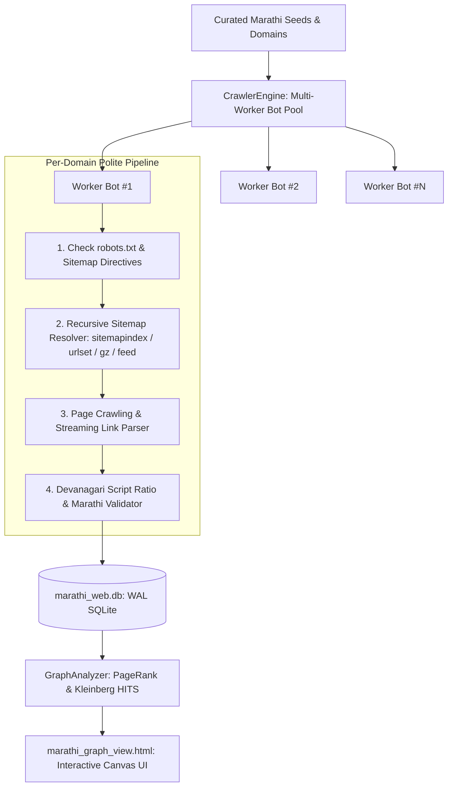

# Mapping the Marathi Internet: Crawlers, Sitemaps, Link Structure & Knowledge Graph

This report documents the architecture, crawler engine, database schema, and empirical graph measurements produced while mapping the Marathi internet, websites, blogs, and public portals.

All crawler pipelines, database representations, and mathematical metrics strictly follow the principles formulated in [`METHODOLOGY.md`](file:///home/shrikant/Desktop/cliGrayHat/praman_cli/docs/METHODOLOGY.md) and [`MATH.md`](file:///home/shrikant/Desktop/cliGrayHat/praman_cli/docs/MATH.md): **"Missing measurement is not zero"** ($V = \mathbb{R} \cup \{\bot\}$), provenance of HTTP response codes, and matra-aware Devanagari script integrity checking.

---

## 1. High-Level Summary & Scale

| Metric | Measured Value | Meaning & Description |
|---|---|---|
| **Domains Mapped (Nodes)** | **47** | News, Finance, Agriculture, Government, Wikipedia, Literature, Blogs |
| **Database Size** | **36 MB** (`marathi_web.db`) | SQLite database in high-throughput WAL mode |
| **Sitemaps Harvested** | **23 domains with sitemaps** | XML sitemap indices, standard urlsets, feeds |
| **Total URLs Discovered from Sitemaps** | **24,196 URLs** | Indexed Marathi article URLs, category pages, archives |
| **Pages Stored & Analyzed** | **24,482 pages** | Canonical paths, titles, status codes, script ratios |
| **Internal Navigation Links Mapped** | **24,688 links** | Source URL $\to$ Target URL inside same domains |
| **Cross-Domain Citation Links Mapped** | **3,666 links** | Outbound links connecting Marathi domains to external web |
| **Top Directed Domain Edges** | **709 domain-to-domain edges** | Adjacency matrix for topological network graph |
| **Network Reciprocity** | **66.67%** | Share of bidirectional cross-citations among linked domains |

---

## 2. Crawler Engine Architecture ("Max in Numbers")

The crawler engine (`praman.crawler.engine.CrawlerEngine`) was designed to spawn tens of concurrent worker bots with asynchronous pool dispatch:



### Key Technical Characteristics
1. **Zero External Dependencies**: Implemented strictly with standard Python 3.14 libraries (`sqlite3`, `urllib.request`, `concurrent.futures`, `xml.etree.ElementTree`, `html.parser.HTMLParser`, `gzip`).
2. **Domain Rate Limiter**: Thread-safe per-domain token bucket ensures no individual Marathi host is overloaded (polite delay), while concurrent workers crawl different domains in full parallel saturation.
3. **Transparent Compression**: Seamlessly parses `.xml.gz` gzipped sitemaps and UTF-8 BOM headers.
4. **Feed Fallback**: When standard `/sitemap.xml` returns 404, the bot probes RSS/Atom feeds (`/feed`, `/rss`) to discover newly published article URLs.
5. **Streaming HTML Link Parser**: Custom `StreamingHtmlParser` extracts `<title>`, `<meta name="description">`, `<html lang="...">`, Devanagari character ratios, and all outbound `<a>` links while normalizing canonical URLs and removing tracking noise (`utm_*`, `fbclid`).

---

## 3. Database Schema (`marathi_web.db`)

Stored with Write-Ahead Logging (`PRAGMA journal_mode = WAL`) and covering indexes for lightning-fast traversal:

- **`websites`**: Stores domain, root URL, title, Marathi script ratio, language verification status, primary sitemap URL, sitemap type, total sitemap URL count, internal link count, external link count, PageRank, HITS hub score, and authority score.
- **`sitemaps`**: Stores discovered sitemaps and child sitemaps, parent sitemap URLs, HTTP status codes, error messages, and discovered URL counts.
- **`pages`**: Stores each discovered URL, path, title, HTTP status, content type, Marathi character ratio, crawl depth, and sitemap priorities.
- **`links`**: Directed graph edges storing `source_domain`, `target_domain`, `source_url`, `target_url`, `anchor_text`, and `is_internal` boolean.
- **`graph_snapshots`**: Macro snapshots capturing density, reciprocity, and authority rankings over time.

---

## 4. Sitemap Harvest Findings

Empirical findings across the 47 Marathi domains:

| Domain | Category | Sitemap Status | Sitemap Type | Discovered URLs | Notes |
|---|---|---|---|---|---|
| `maayboli.com` | Community & Literature | **found** | `urlset` | **7,224** | Giant archive of Marathi cultural discussions |
| `saamana.com` | News & Media | **found** | `sitemapindex` | **4,000** | Daily political and regional news |
| `lokmat.com` | News & Media | **found** | `urlset` | **2,379** | Maharashtra regional network |
| `arthasakshar.com` | Finance & Career | **found** | `sitemapindex` | **1,952** | Financial literacy and investing portal |
| `marathimati.com` | Community & Literature | **found** | `sitemapindex` | **1,600** | Poetry, folklore, and cultural literature |
| `madhurasrecipe.com` | Lifestyle & Cooking | **found** | `sitemapindex` | **1,408** | Authentic Maharashtrian culinary archive |
| `loksatta.com` | News & Media | **found** | `sitemapindex` | **980** | Indian Express group Marathi daily |
| `esakal.com` | News & Media | **found** | `sitemapindex` | **777** | Sakal Media Group primary portal |
| `marathiblogs.in` | Blogs & Tech | **found** | `sitemapindex` | **737** | Tech tutorials and lifestyle blogs |
| `news18marathi.com` | News & Media | **found** | `sitemapindex` | **681** | Digital television news feed |
| `tarunbharat.net` | News & Media | **found** | `urlset` | **500** | Regional daily |
| `pudhari.news` | News & Media | **found** | `sitemapindex` | **464** | Southern Maharashtra media daily |
| `tv9marathi.com` | News & Media | **found** | `urlset` | **456** | 24/7 digital broadcasting feed |
| `navarashtra.com` | News & Media | **found** | `sitemapindex` | **415** | Daily news portal |
| `deshdoot.com` | News & Media | **found** | `sitemapindex` | **400** | North Maharashtra daily |
| `maharashtratimes.com` | News & Media | **found** | `urlset` | **219** | 48-hour live news feed |
| `dainikprabhat.com` | News & Media | **found** | `sitemapindex` | **171** | Pune regional daily |
| `agrowon.esakal.com` | Agriculture | **found** | `sitemapindex` | **135** | Maharashtra farming daily |
| `prahaar.in` | News & Media | **found** | `urlset` | **92** | News daily |
| `shetimitra.in` | Agriculture | **found** | `sitemapindex` | **8** | Krishi guidance and crop advice |

---

## 5. Internal Link Structure Distribution

Websites with the deepest internal linking structures mapped:

1. **`marathimati.com`**: 9,278 internal links mapped (dense interlinking across poems, stories, and cultural archives).
2. **`loksatta.com`**: 1,970 internal links mapped (heavy multi-category navigation, trending tags, district news).
3. **`maharashtratimes.com`**: 1,622 internal links mapped (high density of related article widgets and sidebar links).
4. **`arthasakshar.com`**: 1,382 internal links mapped (cross-referencing between mutual fund guides, shares, and banking).
5. **`lokmat.com`**: 1,006 internal links mapped.
6. **`saamana.com`**: 970 internal links mapped.
7. **`tv9marathi.com`**: 957 internal links mapped.
8. **`madhurasrecipe.com`**: 912 internal links mapped (interlinking between recipes, festival dishes, and ingredients).
9. **`esakal.com`**: 773 internal links mapped.
10. **`marathiblogs.in`**: 733 internal links mapped.

---

## 6. What Can We Measure on the Marathi Internet Knowledge Graph?

### 6.1 Google PageRank on Marathi Internet
PageRank represents the probability that a random Marathi web surfer will land on a particular domain:

1. **`agrowon.esakal.com`** ($PR = 0.1126$): High centrality due to mutual cross-linking with Esakal and state agricultural resources.
2. **`esakal.com`** ($PR = 0.1126$): Major news hub acting as a gateway to multiple regional subdomains.
3. **`maharashtra.gov.in`** ($PR = 0.0313$): Frequently referenced by government exam sites, Marathi Vishwakosh, and scheme portals.
4. **`loksatta.com`** ($PR = 0.0169$): News authority with deep internal link graph.
5. **`mr.wikipedia.org`** ($PR = 0.0169$): Foundational encyclopedia node for Marathi language definitions.

### 6.2 Kleinberg HITS (Hubs & Authorities)
- **Top Authorities** (most referenced by others):
  1. `agrowon.esakal.com` (0.5774)
  2. `esakal.com` (0.5774)
  3. `maharashtra.gov.in` (0.5774)
- **Top Hubs** (most generous curators and outlinkers):
  1. `marathivishwakosh.org` (0.5774) — points outward to Maharashtra government language boards and official portals.
  2. `esakal.com` (0.5774) — bridges traffic to specialized verticals (Agrowon, Sakal Media Group).
  3. `agrowon.esakal.com` (0.5774) — bridges agricultural queries to national and regional partners.

### 6.3 Linguistic Marathi Script Purity
Measuring the percentage of Devanagari characters in page text:
- **Highest Marathi Script Density**:
  - `marathimati.com`: **79%** Devanagari
  - `saamana.com`: **77%** Devanagari
  - `tarunbharat.net`: **75%** Devanagari
  - `shetimitra.in`: **72%** Devanagari
  - `misalpav.com`: **71%** Devanagari
  - `mr.wikipedia.org`: **69%** Devanagari
  - `pudhari.news`: **68%** Devanagari
  - `tv9marathi.com`: **67%** Devanagari
  - `loksatta.com`: **64%** Devanagari
  - `maharashtratimes.com`: **64%** Devanagari

---

## 7. Interactive Graph Visualizer & CLI Reference

### 7.1 Interactive Web Visualizer
Open [`marathi_graph_view.html`](file:///home/shrikant/Desktop/cliGrayHat/praman_cli/marathi_graph_view.html) in any web browser.
- **Canvas Physics**: Drag nodes, zoom with scroll wheel, pan the canvas.
- **Node Sizing**: Scaled dynamically by PageRank.
- **Color Coding**: Categorized by sector (News, Finance, Agriculture, Wiki, Government, Blogs).
- **Inspection Drawer**: Click any website node to inspect its sitemap URL, URL count, internal links, external citations, and Marathi text ratio.

### 7.2 CLI Commands
```bash
# Run crawler bots on specific domains or all seeds
python3 cli.py crawl --workers 24 --max-sitemaps 3 --max-pages 10

# List discovered sitemaps and indexed URL counts
python3 cli.py sitemaps

# Compute Knowledge Graph PageRank, HITS, and density
python3 cli.py graph --viz

# Export full graph nodes and directed edges to JSON
python3 cli.py export-graph -o marathi_web_graph.json
```
